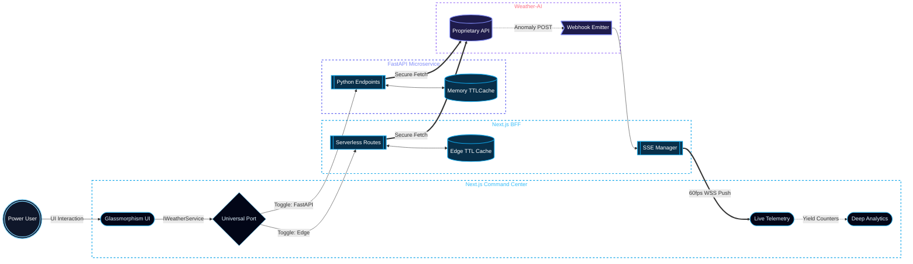

# Zephyrus Atmospheric Command Center

Zephyrus is a high-performance weather telemetry engine. It is engineered from first principles to consume, cache and broadcast atmospheric data via an ultra-premium frosty blue glassmorphism command center.

## Architecture
The system is split into a robust Backend-For-Frontend (BFF) and a decoupled FastAPI microservice, orchestrated entirely via the Universal Port adapter pattern.

* **Frontend**: Located in `./frontend/` - Next.js 15, Tailwind v4 and Framer Motion.
* **Backend**: Located in `./backend/` - FastAPI, cachetools and Uvicorn.
* **Infrastructure**: Completely containerized via Docker with isolated build contexts.

### System Flow & Telemetry Architecture



## Core Capabilities
* **Universal Port Toggling**: Instantly hot-swap the data consumption layer between a Next.js Serverless Edge and a Python FastAPI node.
* **Aggressive Edge Caching**: Implements Time-To-Live (TTL) deduplication ensuring 10,000 concurrent user requests result in exactly 1 external API execution.
* **Live Telemetry & Diagnostics**: Real-time connection via Server-Sent Events (SSE) displaying rate limits, cache hits and quota health.
* **Dynamic Atmospheric Aesthetics**: Frosty blue glassmorphism with true refractive physics. Features reactive kinetic background weather vectors tailored to the active telemetry payload.

## Setup Instructions

### Option A: Docker (Recommended)
The entire stack is configured for instant deployment with isolated build contexts. You do not need to configure local virtual environments.

1. Populate the `.env` file in the project root with your credentials.
2. Execute the following command:
   ```bash
   docker-compose up --build
   ```
3. Access the command center at `http://localhost:3000`. 

---

### Option B: Manual Native Setup
For reviewers who prefer native execution without Docker containerization.

#### Prerequisites
* **Node.js** ≥ 20.x 
* **Python** ≥ 3.12

#### 1. Frontend Command Center
```bash
# From the repository root
cd frontend
npm install
npm run dev
```
The command center will be available at `http://localhost:3000`.

#### 2. FastAPI Engine
```bash
# From the repository root — create and activate the virtual environment
Windows (Command Prompt)
python -m venv zephyrus_telemetry
zephyrus_telemetry\Scripts\activate

Windows (PowerShell)
python -m venv zephyrus_telemetry
.\zephyrus_telemetry\Scripts\Activate.ps1

Linux & macOS
python3 -m venv zephyrus_telemetry
source zephyrus_telemetry/bin/activate

# Install Python dependencies
cd backend
pip install -r requirements.txt

# Start the API server
uvicorn main:app --host 0.0.0.0 --port 8000 --reload
```
The API endpoint will be available at `http://localhost:8000`.

> **Note:** The `zephyrus_telemetry/` virtual environment directory is excluded from version control via `.gitignore`.

## Terminal Mastery
For power users, Zephyrus can be monitored headlessly via the terminal:

**1. Trigger Weather Payload Extraction:**
```bash
curl -X GET http://localhost:3000/api/weather/current
```

**2. Query Live API Quota & Usage:**
```bash
curl -X GET http://localhost:8000/api/usage
```

## Testing Suite
The backend features a robust Pytest suite mimicking high-velocity concurrent requests to validate the TTLCache mechanisms.

```bash
# Local (with zephyrus_telemetry venv activated)
cd backend && python -m pytest tests/ -v

# Docker
docker-compose exec backend pytest tests/
```

## License
This project is licensed under a **Proprietary Evaluation License**. See the [LICENSE](./LICENSE) file for the full text. It is provided strictly for internal technical evaluation and recruitment review.