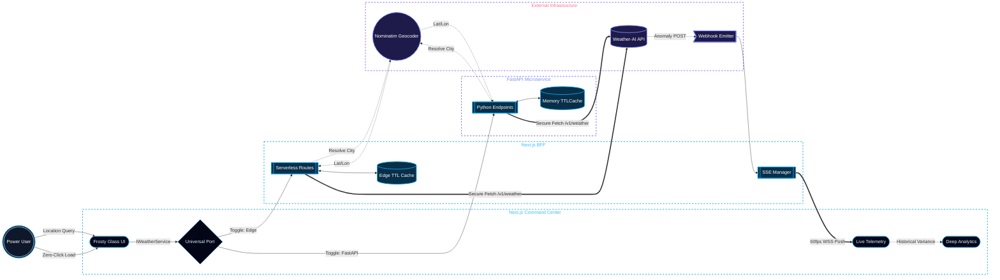

# Zephyrus Atmospheric Command Center

Zephyrus is a high-performance, enterprise-grade weather telemetry engine. It is engineered from first principles to consume, cache, and broadcast atmospheric data via an ultra-premium, dynamic glassmorphism command center.

## Architecture
The system is bifurcated into a robust Next.js Backend-For-Frontend (BFF) and a decoupled Python FastAPI microservice. The entire data consumption layer is orchestrated via the **Universal Port** (Adapter Pattern), allowing the UI to hot-swap backend nodes instantly.

* **Frontend**: Located in `./frontend/` - Next.js 15, Tailwind v4 and Framer Motion.
* **Backend**: Located in `./backend/` - FastAPI, cachetools and Uvicorn.
* **Infrastructure**: Completely containerized via Docker with isolated build contexts.

### System Flow & Telemetry Architecture



## Core Capabilities
* **Universal Port Toggling**: Instantly hot-swap the data consumption layer between a Vercel-optimized Next.js Edge and a Python FastAPI node.
* **Aggressive TTLCaching**: Protects proprietary API quotas via Time-To-Live deduplication, ensuring that 10,000 concurrent user requests result in exactly 1 external network execution.
* **Live Telemetry & Diagnostics**: Real-time connections track dynamic API rate limits, edge cache hits, and proprietary gateway quota health.
* **Dynamic Atmospheric Aesthetics**: Frosty blue glassmorphism utilizing `framer-motion`. Features massive kinetic background vectors (e.g., swaying tornado lines, crescent moon orbits) that programmatically react to live day/night API flags and active weather payloads.

## Data Acquisition Protocols
Zephyrus utilizes a multi-tiered fallback pipeline to ensure the UI is perpetually populated with atmospheric data:

1. **Zero-Click Geo-IP Onboarding**: On initial launch, the system captures edge headers to resolve the user's IP, automatically displaying local telemetry without permission friction.
2. **Inline City Geocoding**: Users can click the location text to reveal a sleek, frosted-glass input. Typing a city name (e.g., `Tokyo`) triggers a server-side request to the *Nominatim OpenStreetMap API* to securely resolve exact `Lat/Lon` coordinates before pinging Weather-AI.
3. **Precise Coordinate Injection**: Enter exact coordinates (e.g., `40.71, -74.00`) to bypass the geocoder and fetch micro-local telemetry directly.
4. **Global Atmospheric Fallback**: If network restrictions block IP detection, the engine falls back to a 5-minute rotational loop, continuously cycling through global hubs (Nairobi, New York, Tokyo, London) to prevent dead UI states.

## Project Structure

```text
zephyrus-telemetry/
├── frontend/             # Next.js command center (isolated build context)
│   ├── app/              # App router, BFF API routes & global styles
│   ├── components/       # UI elements (GlassPanels, WeatherVisuals)
│   ├── services/         # Universal Port adapters (NextBFF, FastAPI)
│   ├── lib/              # Theme handlers & utility mappers
│   ├── package.json      # Node.js dependencies
│   └── next.config.ts    # Next.js 15 configuration
│
├── backend/              # FastAPI extraction engine (isolated build context)
│   ├── main.py           # FastAPI entry point & caching logic
│   ├── requirements.txt  # Python dependencies
│   └── tests/            # Pytest test suite
│       └── test_main.py  # TTL caching and async routing tests
│
├── misc/                 # Documentation and deployment playbooks
├── docker-compose.yml    # Multi-container orchestration
├── .env.example          # Environment variables template
├── README.md             # This file
└── LICENSE               # Proprietary evaluation license
```

## Setup Instructions

### Option A: Docker (Recommended)
The entire stack is configured for instant deployment with isolated build contexts. You do not need to configure local virtual environments.

1. Duplicate `.env.example` to `.env` in the project root and inject your `WEATHER_AI_API_KEY`.
2. Execute the orchestration command:
   ```bash
   docker-compose up --build
   ```
3. Access the Command Center at `http://localhost:3000`. The Python node connects automatically on port 8000.

---

### Option B: Manual Native Setup
For reviewers inspecting the system outside of containerization.

#### Prerequisites
* **Node.js** ≥ 20.x 
* **Python** ≥ 3.12

#### 1. Frontend Command Center
```bash
# From the repository root
cd frontend
npm install
npm run dev
```
The command center will mount at `http://localhost:3000`.

#### 2. FastAPI Engine
```bash
# From the repository root — create and activate the virtual environment
Windows (Command Prompt)
python -m venv zephyrus_telemetry
zephyrus_telemetry\Scripts\activate

Windows (PowerShell)
python -m venv zephyrus_telemetry
.\zephyrus_telemetry\Scripts\Activate.ps1

Linux & macOS
python3 -m venv zephyrus_telemetry
source zephyrus_telemetry/bin/activate

# Install Python dependencies
cd backend
pip install -r requirements.txt

# Start the API server
uvicorn main:app --host 0.0.0.0 --port 8000 --reload
```
The API endpoint will be available at `http://localhost:8000`.

> **Note:** The `zephyrus_telemetry/` virtual environment directory is excluded from version control via `.gitignore`.

## Terminal Mastery
For power users, Zephyrus can be monitored headlessly via terminal utilities:

**1. Trigger Payload Extraction via City:**
```bash
curl -X GET "http://localhost:3000/api/weather/current?location=Seattle,%20USA"
```

**2. Trigger Payload Extraction via Exact Coordinates:**
```bash
curl -X GET "http://localhost:3000/api/weather/current?location=40.71,-74.00"
```

**3. Query Live Proprietary API Quotas:**
```bash
curl -X GET http://localhost:8000/api/usage
```

## Testing Suite
The Python microservice features a robust Pytest suite mimicking high-velocity concurrent requests to validate the integrity of the asynchronous TTLCache mechanisms.

```bash
# Local (with zephyrus_telemetry venv activated)
cd backend && python -m pytest tests/ -v

# Docker
docker-compose exec backend pytest tests/
```

## License
This project is licensed under a **Proprietary Evaluation License**. See the [LICENSE](./LICENSE) file for the full text. It is provided strictly for internal technical evaluation and recruitment review.